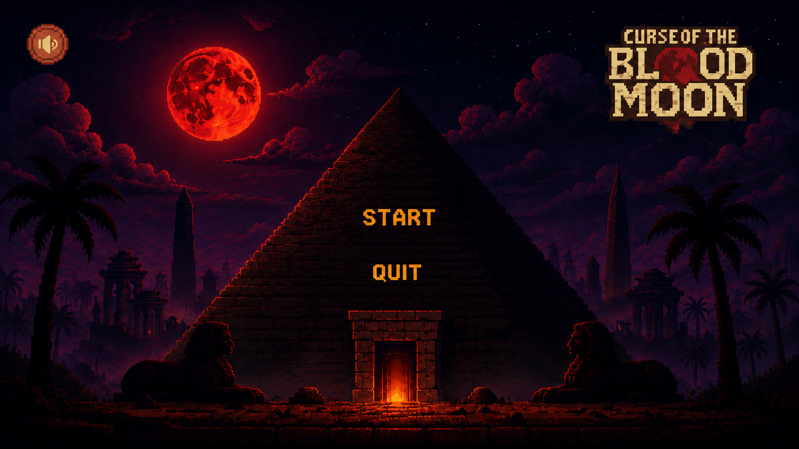
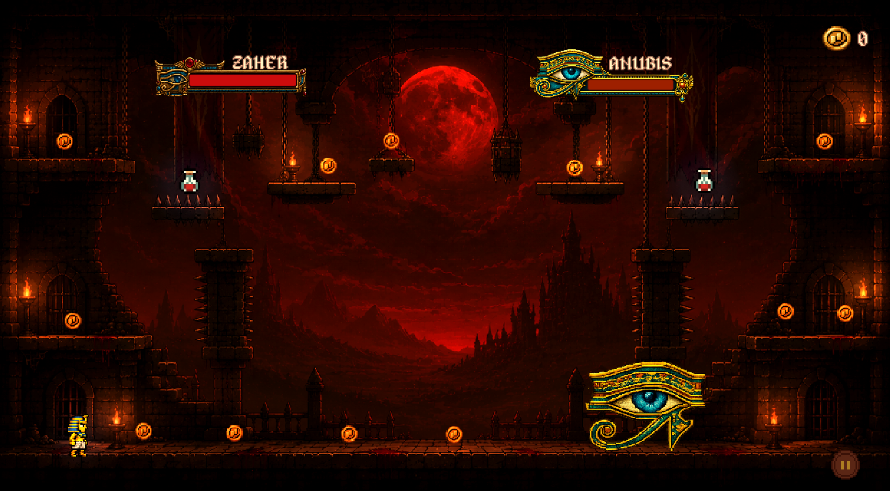

# 🌕 Curse of the Blood Moon

A 2D pixel-art action platformer inspired by Ancient Egyptian mythology, developed with Unity.

---

## 📖 Story

The Blood Moon has cursed the ancient lands of Egypt. Play as Zaher, battle powerful guardians, uncover forgotten secrets, and lift the curse before darkness consumes the kingdom.

---

## 🎮 Features

- ⚔️ Fast-paced 2D action platformer
- 🏺 Ancient Egyptian themed world
- 👹 Unique boss battles
- 🎨 Pixel Art graphics
- 🎵 Original sound effects and music
- 🛒 Shop & weapon upgrade system
- ❤️ Health potion system

---

## 📸 Gameplay

---

## 🛠️ Built With

- Unity 6
- C#
- Blender
- Aseprite
- Adobe Photoshop

---

## 📥 Download

The playable Windows version is available in the **Releases** section.

---

## 👩‍💻 Developer

**Emine Yaman**
